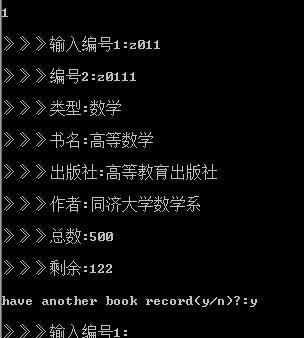

# **Library_System**

C语言程序设计期末实训作业，选择题目是做一个**图书信息管理系统**，题目要求放在最后。

用链表设计，写的比较糙。repo 中附上了实训报告的思维导图、图片等资料。

源码用的是 gb2312，注意在编辑器中调节，以免中文注释乱码。

最后祝找（chao）实训作业能找（抄）到 github 的同学期末pass！

---

题目要求：

**题目9：图书信息管理系统**

【涉及知识点】

文件的定义和操作；

使用文本构建菜单；

函数的选择调用；

数据的输入输出。

【题目介绍】

图书信息管理系统设计

【功能要求】

1、系统以菜单方式工作。

2、图书信息录入功能(图书信息用文件保存)－－输入。

3、图书信息浏览功能－－输出。

4、图书信息查询功能（查询方式）有：按书名查询 和按作者名查询两种方式。

5、图书信息的删除与修改(可选项)。

【难点与提示】

根据题目要求，应当把图书信息用结构体形式输入，再定义一个全局变量和文件指针进行整个程序的运行，然后把图书信息送到文件中，所以应该提供一个结构体和文件的输入输出等操作；在程序中需实现图书信息输入，浏览，查询，删除和修改等功能的操作，建立相应的子函数来实现；另外还需提供键盘式选择菜单实现功能，在运行时达到所要目的。

设计了一个图书信息文件，输入新图书信息，浏览图书，修改，删除图书等一些操作时在图书信息文件上运行。运用 C 语言的文件功能，此文件也是整个程序的主线。

图1给出了图书信息系统主菜单，图2给出了图书查询界面。

	    

【更上一层楼】

本题可使用文本构建菜单完成，可适当提高难度调用图形函数结构构建菜单。
