# xxxxxxx课程设计（实训）说明书

## 图书信息管理系统程序说明书

## 1. 需求分析

### 1.1 编写目的

随着人们生活水平的日益提高，人们对文化的需求也越来越大。在人们的业余生活中，越来越多的人乐于享受文字给生活带来的乐趣。而图书也是学生的学习过程中必不可少的。
而本项目旨在研发一个图书馆的管理系统，实现图书馆的信息化管理。在方便读者查询借阅图书的同时，方便图书馆管理员对图书进行管理。

### 1.2 功能介绍

程序设计用于管理图书信息化管理，使用对象为普通用户、管理员。实现对用户（普通用户、管理员）的账号管理、图书上新、图书查询、图书下架、图书信息修改等的功能。

1. **用户信息导入**：用户名、账号、密码、账号类型

2. **图书信息导入**：编号、书名、作者、出版商、出版日期、价格、库存

3. **帐号登陆**：登录成功调用对应函数、登陆失败错误处理

4. 用户信息管理：

   * 管理员

     新增用户、删除用户、修改用户账号信息

   * 用户

     修改密码

5. 图书信息管理：

   * 管理员：

     图书上架、图书下架、图书搜索、图书信息修改、图书列表浏览

   * 用户：

     图书查询

   

## 2. 概要设计

程序的运行基本流程如图所示：


### 1. 数据导入

将以文件形式保存的用户信息、图书信息读入到内存中。这里采取的基于结构体的动态链表，存储导入的信息。加载信息完成后，输出字符画以及欢迎语。

### 2. 帐号登录

为确保用户正确填写帐号密码信息，显示提示信息：“请输入用户名和密码或帐号和密码”。这里有两种情况：登录成功、登录失败（含输入信息错误）。当登录成功时，进入对应用户类型的操作界面。登录失败，则给出提示：“输入信息错误，退出请按0，再次输入按1”，以询问用户是否再次尝试登录。登录失败的异常处理，使用 while 循环，直到用户选择退出程序。

用户在看到提示信息输入用户信息之后，将获取到的信息传入密码校验函数，基于密码校验函数返回值，判断登录成功状态。查询登录用户结构体内的用户类型 type 的值，以此判断进入的用户操作界面。

### 3. 管理员入口

输出操作选项类别：用户管理、图书信息管理、注销。获取管理员操作选项后，使用 switch 进入对应功能函数。进入对应的功能函数后，显示此选项下提供的功能。``用户管理``选项功能：添加账号、删除账号、输出已有账号、重置用户密码、返回上一层菜单。``图书信息管理``选项功能：新书上架、输出图书信息、查询、旧书下架、修改图书信息、返回上一层菜单。

#### 3.1 用户管理

##### 3.1.1 添加账号

进入函数后，首先以重新加载用户信息的方式，寻找到用户信息的链表的链尾内存地址。为确保用户正确填写新增用户信息，显示提示信息：“请依次输入用户名、账号、密码和类别，输入#表示输入结束”，以及给出示例模版：“输入示例：张三 1 111111 用户”。

##### 3.1.2 删除帐号

为确保用户正确填写删除用户信息，显示提示信息：“请输入待删除的读者用户名或账号信息”。获取到帐号信息后，进行校验帐号存在性，如果不存在，则输出错误提示：“查无读者信息，无法删除”。存在则进项该用户信息堆块脱链，并释放，完成后输出提示信息：“读者信息已删除”。结束操作后，将新的链表保存到文件中。

##### 3.1.3 输出已有帐号

显示输出帐号功能菜单，用 switch 实现选择功能。while 循环输出直到链尾，其中加入判断条件 type 值，从而实现分别输出管理员、普通用户帐号信息。

##### 3.1.4 重置用户密码

为确保用户正确填写删除用户信息，显示提示信息：“请输入待删除的读者用户名或账号信息”。获取到帐号信息后，遍历链表进行校验帐号存在性，如果不存在，则输出错误提示：“未找到对应的用户名或账号”。存在则进项该用户信息进行覆写，完成后输出提示信息：“已重置用户密码”。结束操作后，将新的链表保存到文件中。

#### 3.2 图书管理

##### 3.2.1 新书上架

进入函数后，首先以重新加载书籍信息的方式，寻找到数据信息的链表的链尾内存地址。为确保用户正确填写新增数据信息，显示提示信息：“请依次输入图书编号、书名、作者、出版社、类别、出版年月日、价格、库存,输入-1表示输入结束”，以及给出示例模版：“输入示例：201501 西游记 吴承恩 中华 名著 19580624 56 59”。使用 while 循环录入信息，直到用户结束输入。结束录入后，将新的链表保存到文件中。

##### 3.2.2 输出图书信息

判断链表指针的 next 值，确定是否有图书信息存在链表中。

##### 3.2.3 查询

显示输出查询功能菜单，用 switch 实现选择功能。遍历链表中的书名或作者名寻找书籍，并输出。当没有对应书籍信息时，输出错误提示："该书信息不存在”。

##### 3.2.4 旧书下架

显示输出查询功能菜单，用 switch 实现选择功能。遍历链表中的书名或编号寻找书籍，若存在则将该堆块脱链并释放，并输出修改后的新链表，保存链表到文件中；不存在给出错误提示信息：“该图书信息不存在”。

##### 3.2.5 修改图书信息

为确保用户正确填写新增数据信息，显示提示信息：“请输入要修改图书的编号：”。获取编号后，先判断链表是否存在图书信息，然后开始遍历链表，若图书不存在，输出错误提示信息：“图书信息不存在”，若找到图书信息，则输出提示：“该图书的信息已查询到，信息如下”并输出修改书籍原始数据。修改书籍信息采取逐项询问、判断后确定修改信息。遍历询问全部信息后，输出修改后的图书信息。

### 4. 用户入口

#### 4.1 更换密码

为确保用户正确填写新增数据信息，显示提示信息：“请输入您的用户名或账号：”。获取到用户名或帐号后，进入到 while 循环。首先验证帐号的存在性，若帐号不存在，则显示错误提示信息：“账号信息不存在”；帐号存在则要求输入修改帐号的密码，并显示提示：“请输入您原来的密码”。获取密码之后，与当前堆块的 password 比对，正确则给出开始修改密码的提示：“输入您的新密码”，对堆块的 password 覆写完成后，输出成功修改提示：“密码修改成功”。密码校验错误则询问是否再次验证：“密码错误，重新输入请按1， 退出请按2”，直到用户选择退出才返回上一级菜单。

#### 4.2 查询图书信息

用户与管理员使用相同的[查询图书函数](#3.2.3 查询)。


## 3. 详细设计

该程序中：共自定义2个结构体，25个函数；共使用4个全局变量。

### 3.1 main

在主函数 main 中，按照图示顺序依次调用函数。欢迎语部分结构简单，因此直接集成在 main 中，不单独自定义子函数。帐号密码输入部分，利用 printf 给予用户操作提示，使用 scanf 收集用户的输入值保存到变量 id、password 中，传到到 login 函数中进行密码校验等操作。当密码错误时，在 login 函数内部对错误进行处理。显示错误提示信息：“输入信息错误，退出请按0，再次输入按1”，询问用户是否重新输入帐号密码。

注销帐号，则程序流回到欢迎语，开启新一轮循环。

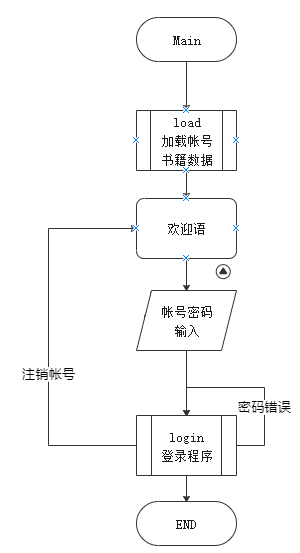

### 3.2 load

程序使用动态链表存储从文件读入的数据。首先定义了两个全局结构体，分别对应书籍、帐号数据。在链表设计上，链首不用作存储数据，仅记录下一个堆块的地址，即 next 。链表结构体如图所示：

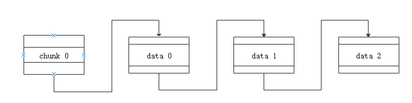

fopen 打开文件形式保存的数据，执行后检验 fp 指针的返回值，确认数据文件的存在性，若文件不存在，给出错误信息后退出程序。文件存在则录入数据。录入数据使用两个自定义结构体指针 p1、p2。p1 指向数据录入的堆块，p2 指向前一个堆块。循环录入流程：p1 指向的 malloc 的 chunk；p1 写入数据；p2 chunk next 指向 p1；p2 指向 p1 chunk。

当 fscanf 返回值为 EOF 结束录入，p2 chunk next 指向 NULL，数据链表初始化完成。

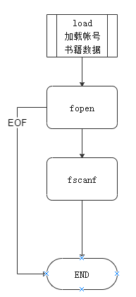

### 3.2 欢迎语

使用 printf 实现，格式化输出字符画。

### 3.3 login

while 循环遍历链表，提取帐号名、帐号、密码传入 compare 做匹配，通过返回值确定密码正确性，如果密码正确则修改全局变量 b ，记录登录状态。然后再使用 if 匹配判断堆块中的用户类型，进入对应的用户操作界面。当密码匹配错误时，进入错误处理的 while 循环。给出错误提示信息：“入信息错误，退出请按0，再次输入按1”，询问用户是否重新登录，循环直到用户登录成功或者退出程序。当用户选择重新登录，并获得输入值后，重复与首次进入 login 密码校验流程。

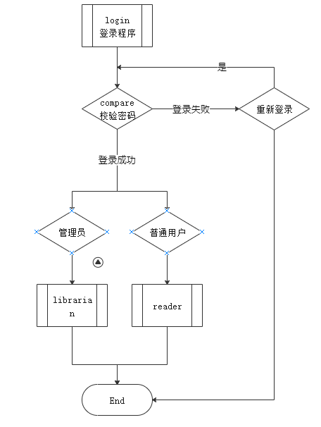

### 3.4 compare

使用 string.h 中提供的函数 strcmp 对帐号名、帐号、密码做一个简单的匹配操作。正确则显示成功信息：“输入信息正确,即将进入系统”，并返回值1；不匹配则返回0。

### 3.5 librarian

printf 给出管理员操作菜单，通过 switch 实现菜单选择，同时使用 while 循环处理用户输入不存在选项的错误情况。

#### 3.5.1 用户管理

printf 给出用户管理操作菜单，通过 switch 实现菜单选择，同时使用 while 循环处理用户输入不存在选项的错误情况。

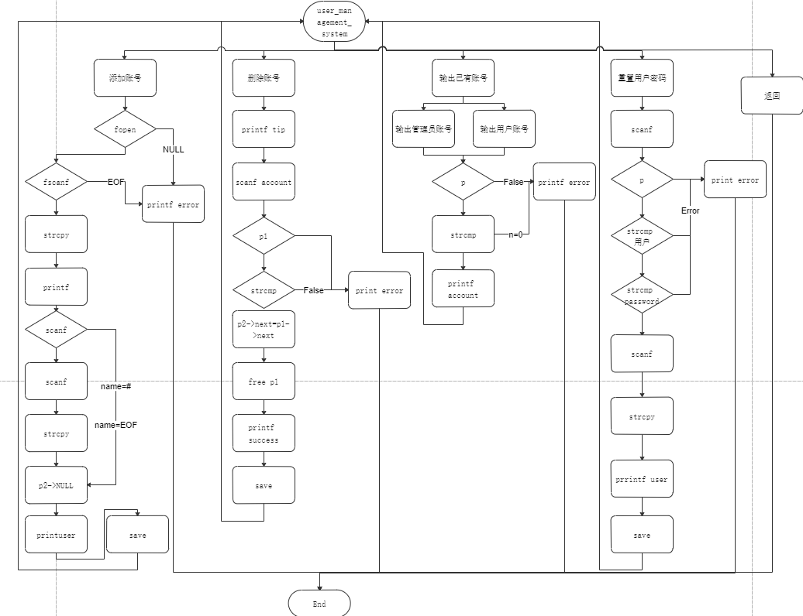

##### 3.5.1.1 添加账号

进入函数后，首先以重新加载用户信息的方式，寻找到用户信息的链表的链尾内存地址。为确保用户正确填写新增用户信息，显示提示信息：“请依次输入用户名、账号、密码和类别，输入#表示输入结束”，以及给出示例模版：“输入示例：张三 1 111111 用户”。使用 while 循环录入数据，直到用户停止输入。新链表构建完成后，调用 save 函数将新链表数据写入到文件中，并打印出新的用户信息列表。

##### 3.5.1.2 删除帐号

进入函数后，首先以重新加载用户信息的方式，寻找到用户信息的链表的链尾内存地址。为确保用户正确填写新增用户信息，显示提示信息：“请输入待删除的读者用户名或账号信息”。用 scanf 获取需要删除的用户信息后，检验用户的存在性，若不存在则给出错误信息：“查无读者信息，无法删除”，并退出函数；若用户存在则将用户 chunk 脱链后 ，free 掉，给出成功删除信息：“读者信息已删除”。

##### 3.5.1.3 输出已有帐号

printf 给出用户管理操作菜单，通过 switch 实现菜单选择，同时使用 while 循环处理用户输入不存在选项的错误情况。根据用户选择的输出类型，进入对应的输出函数 printadmin、 printuser。输出函数内部采取遍历信息链表，使用 strcmp 匹配用户类型，相同则输出的设计原理。

##### 3.5.1.4 重置用户密码

为确保用户正确填写删除用户信息，printf 显示提示信息：“请输入待删除的读者用户名或账号信息”。scanf 获取到帐号信息后，遍历链表 strcmp 进行校验帐号存在性，如果不存在，则输出错误提示：“未找到对应的用户名或账号”。存在且用户类型为用户，则显示修改提示信息：“请输入重置密码”，获取新密码后对用户堆块进行覆写，完成后输出提示信息：“已重置用户密码”。结束操作后，将新的链表保存到文件中。

#### 3.5.2 图书信息管理

printf 给出用户管理操作菜单，通过 switch 实现菜单选择，同时使用 while 循环处理用户输入不存在选项的错误情况。

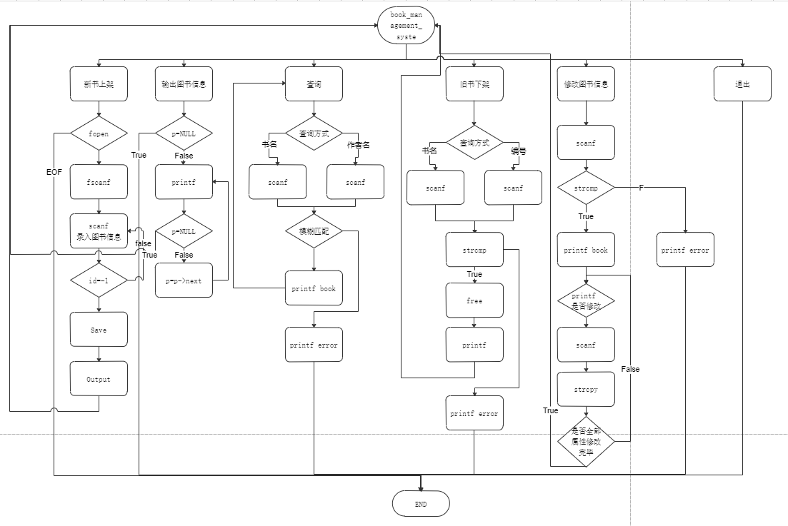

##### 3.5.2.1 新书上架

进入函数后，首先以重新加载图书信息的方式，寻找到图书信息的链表的链尾内存地址。为确保用户正确填写新增用户信息，显示提示信息：“请依次输入图书编号、书名、作者、出版社、类别、出版年月日、价格、库存,输入-1表示输入结束”，以及给出示例模版：“输入示例：201501 西游记 吴承恩 中华 名著 19580624 56 59”。使用 while 循环录入数据，直到用户停止输入。新链表构建完成后，调用 Save 函数将新链表数据写入到文件中，并打印出新的图书信息列表。

##### 3.5.2.2 输出图书信息

检验图书链表的长度，如果链首指向 NULL，则输出错误提醒：“没有图书信息”。否则遍历链表输出图书信息。

##### 3.5.2.3 查询

printf 给出图书查询操作菜单，通过 switch 实现菜单选择，同时使用 while 循环处理用户输入不存在选项的错误情况。根据用户选择的查询类型，进入对应的查询函数 titlesearch、 authorsearch。输出函数内部采取遍历信息链表，使用 strcmp 匹配书名或作者名，相同则输出的设计原理。若遍历完成后，没有匹配值则输出错误提示信息：“该书信息不存在”。

##### 3.5.2.4 旧书下架

printf 给出图书查询操作菜单，通过 switch 实现菜单选择，同时使用 while 循环处理用户输入不存在选项的错误情况。根据用户选择的查询类型，进入对应的查询函数 titledelete、iddelete。

进入函数后，首先以重新加载图书信息的方式，寻找到图书信息的链表的链尾内存地址。为确保用户正确填写新增用户信息，显示提示信息：“请输入要删除图书的书名（编号）”。用 scanf 获取需要删除的图书信息后，检验图书的存在性，若不存在则给出错误信息：“该图书信息不存在”，并退出函数；若图书存在则将图书 chunk 脱链后 ，free 掉，给出成功删除信息：“书籍信息已删除”，然后输出新图书链表。

##### 3.5.2.5 修改图书信息

进入函数后，首先以重新加载图书信息的方式，寻找到图书信息的链表的链尾内存地址。为确保用户正确填写新增用户信息，显示提示信息：“请输入要修改图书的编号”。校验链表中是否存有图书信息，如果没有，则给出错误提示信息：“没有图书信息”。用 scanf 获取需要删除的图书信息后，检验图书的存在性，若不存在则给出错误信息：“该图书信息不存在”，并退出函数；图书存在，则给出提示“该图书的信息已查询到，信息如下”，并输出图书源数据。修改书籍信息采取逐项询问、判断后确定修改信息。遍历询问全部信息后，输出修改后的图书信息，调用 Save 保存图书数据。

### 3.6 reader

printf 给出用户操作菜单，通过 switch 实现菜单选择，同时使用 while 循环处理用户输入不存在选项的错误情况。

#### 3.6.1 更改密码

为确保用户正确填写新增用户信息，显示提示信息：“请输入您的用户名或账号”。对链表进行模糊匹配，验证帐号的存在性，不存在则给出错误提示：“账号信息不存在”；帐号存在，给出提示：“请输入您原来的密码”，要求用户输入原密码。scanf 获取密码，strcmp 匹配校验，错误则询问用户是否再次尝试，知道用户不在尝试才退出函数。密码正确则给出输入密码提示：“请输入您的新密码”，scanf 获取密码，对用户 chunk 覆写，完成后给予提示信息：“密码修改成功”。

#### 3.6.2 查询图书信息

与管理员入口共用 [search](#3.5.2.3 查询) 函数。

### 3.7 用户信息save

fopen 打开用户信息保存文件，检验返回值是否为 NULL，错误则给出提示：“File Open Error”。文件存在，则使用 fprintf 配合 for 循环写入暂存区中。写入完成则使用 fclose 将暂存区数据写入文件中。

### 3.8 图书信息Save

设计思路与[用户信息save](#3.7 用户信息save)相差无几。

## 4. 调试分析

1. 动态链表链首不存放数据，仅记录下一个 chunk 地址。否则当使用删除帐号(图书)功能时，需要删除的账号(图书)位于链首时，删除会破坏链表。
2. 登录失败重新输入处理中，scanf 重新读入帐号密码，写入地址应该是 id、password，而不是 &id、&password。因为两个变量定义的是字符串，变量名等于指针，存储的是字符串首字符地址。

## 5. 测试结果

1. 登陆帐号成功进入操作界面、登录失败异常处理。

   

2. 分用户操作界面。管理员：

   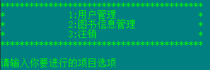

   普通用户：

   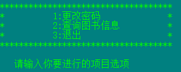

3. 用户管理操作(管理员)

   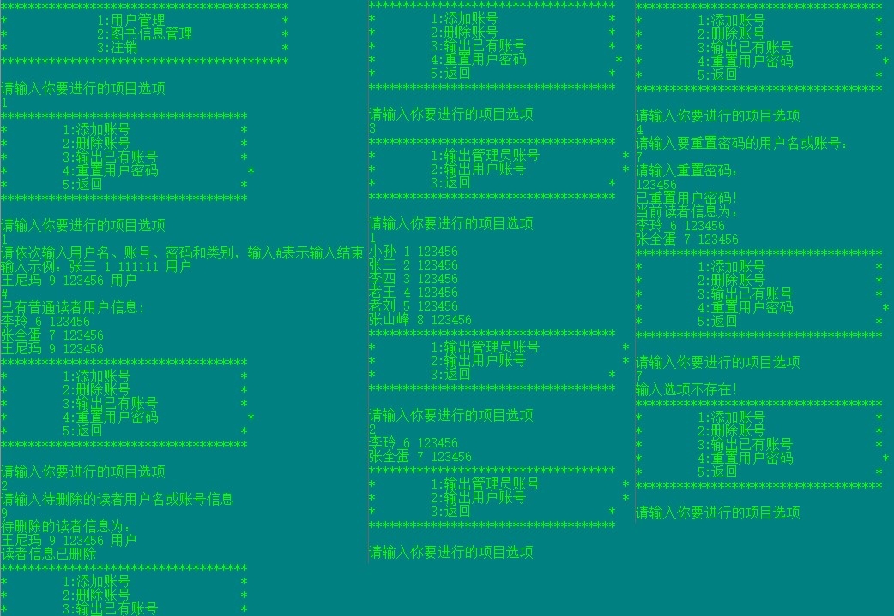

4. 图书信息管理(管理员)

   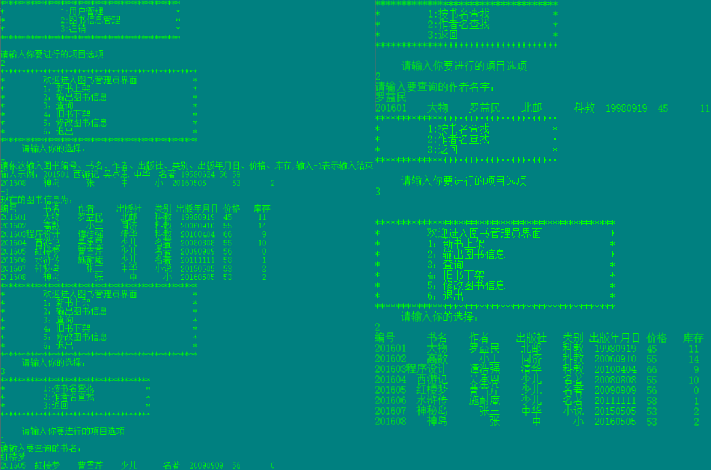

   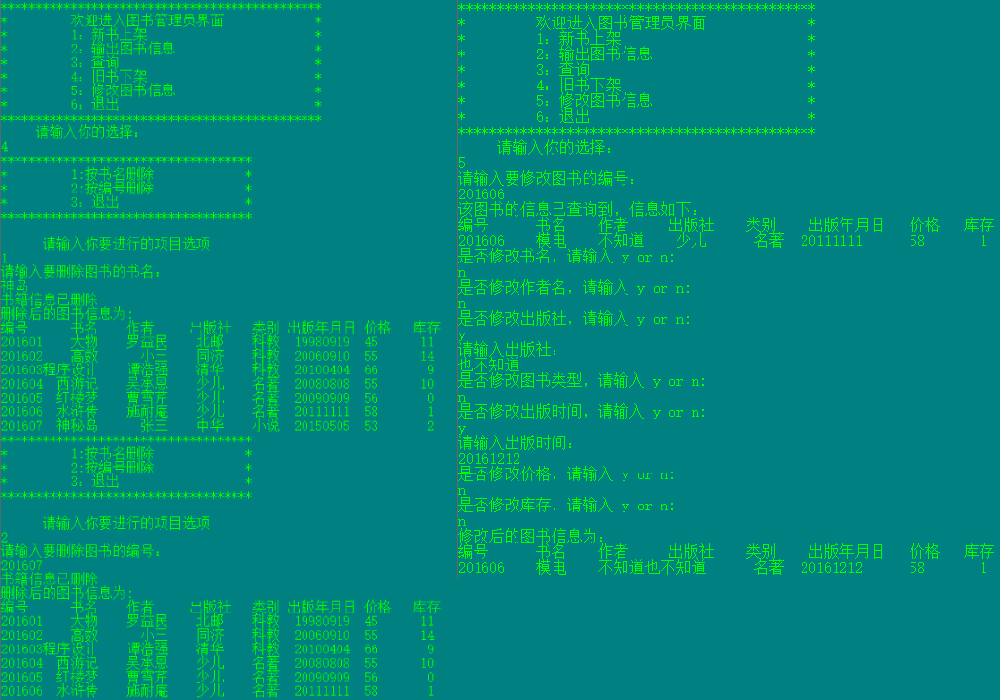

5. 普通用户操作功能

   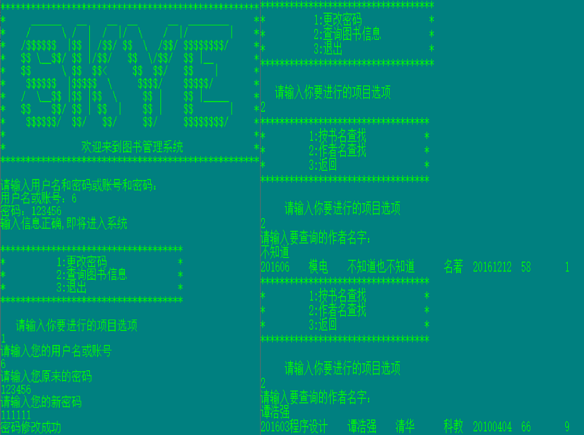

## 6. 用户使用说明

### 6.1 运行操作

1. 用户可以自行编译 main.c 文件，也可以直接运行可执行程序 main.exe。
2. 帐号信息、图书信息均以明文存放分别存放在：userinfo.txt、bookinfo.txt。

### 6.2 常见问题及解决方案

1. **问题**：提示“File Open Error!”。

   **解决方案**：检查 main.exe 所在目录下是否存在 userinfo.txt、bookinfo.txt 这两个文件，如果没有请手动新建。

2. **问题**：忘记密码怎么找回。

   **解决方案**：打开程序根目录下的 userinfo.txt ，密码以明文保存。

3. **问题**：源码 main.c 打开中文乱码。

   **解决方案**：使用 gb2318 编码格式重新打开。

## 7. 已知缺陷

1. 管理函数中的添加账号等需要获取链表链尾地址的函数，获取函数方式是重建链表，导致原有堆块未被释放而留存在内存中。如果多次进行操作，可能存在内存溢出风险。
2. 帐号、图书信息以明文形式保存在本地文件中。
3. 普通用户修改密码的功能函数，设计存在逻辑缺陷。假如A与B密码相同，A登录后，在使用改密码功能时，输入B帐号与密码也能够操作成功。
4. 登录、密码修改函数模块，均为设置尝试次数，可被爆破。
5. 具有删除功能的函数模块，在释放堆块后，未将操作指针归零，或存在 UAF 漏洞。

## 8. 参考文献

1. 谭浩强著.C程序设计（第四版）.北京清华大学出版社，2010
2. [绝地反击T](https://blog.csdn.net/u012110719).[C语言编程：变换命令行的颜色color](https://blog.csdn.net/u012110719/article/details/44679683), 2015
3. [runoob](https://www.runoob.com/).[C 语言教程](https://www.runoob.com/cprogramming/c-tutorial.html),2013
4. edrawsoft.[C语言程序流程图](https://www.edrawsoft.cn/draw-program-flowchart/),2016

## 附件

**管理系统目录结构**

```
图书信息管理系统
├─ Library_System
│  ├─ bookinfo.txt
│  ├─ main.c
│  ├─ main.exe
│  └─ userinfo.txt
├─ img
├─ readme.md
├─ 思维导图
├─ 程序设计说明书.docx
└─ 程序设计说明书.md
```

**图书信息管理系统源码**

```c
#include <stdio.h>
#include <stdlib.h>
#include <string.h>

//定义学生用户结构体
struct Student
{
    char name[10];//用户名
    char id[10];//账号
    char password[8];//密码
    char type[10];//类型
    struct Student *next;//下一个链表地址
};
//重命名类型名
typedef struct Student student, *student_pointer;

//定义数据信息结构体
struct Book
{
    int  id;//编号
	char name[20];//书名
	char author[20];//作者
	char publisher[20];//出版商
	char type[20];//类型
	int pubtime;//出版时间
	int price;//价格
	int Num;//退出状态码
    struct Book *next;//下一个链表地址
};
//重命名类型名
typedef struct Book book, *book_pointer;
//定义全局状态码
int select, b=0;
//定义结构体指针
book_pointer book_head;
student_pointer student_head;


//声明全局函数
void load(book_pointer book_head,student_pointer student_head);//将文件中的信息加载到链表中
void login(student_pointer k,char str1[],char str2[]);//检验账号信息函数
int compare(char k[],char m[], char n[], char str[], char password[]);//密码校验
void librarian(book_pointer book_head, student_pointer student_head);//管理员入口函数
void user_management_system(student_pointer student_head);//用户管理函数
void reader(book_pointer book_head, student_pointer student_head);//普通读者函数
void change(student_pointer student_head);//修改用户密码
void adduser(student_pointer student_head);//新增用户
void deleteuser(student_pointer student_head);//删除用户
void print(student_pointer student_head);//显示读者信息入口函数
void printuser(student_pointer student_head);//输出用户信息
void printadmin(student_pointer student_head);//输出管理员信息
void save(student_pointer student_head);//保存用户信息
void password(student_pointer student_head);//读者更改密码
void book_management_system(book_pointer book_head);//图书信息管理函数
void newbook(book_pointer book_head);//添加图书信息
void Save(book_pointer book_head);//将图书馆信息导入文件中
void Output(book_pointer book_head);//输出图书信息
void oldbook(book_pointer book_head);//旧书下架
void titledelete(book_pointer book_head);//按书名删除书籍
void iddelete(book_pointer book_head);//按编号删除书籍
void search(book_pointer book_head);//查询图书信息
void titlesearch(book_pointer book_head);//书名查找
void authorsearch(book_pointer book_head);//作者名查找
void modify(book_pointer book_head);//图书信息修改

int main()
{
    system("color 3a");//命令行换色
    //赋值用户结构体头指针
    student_head=(student_pointer)malloc(sizeof(student));
    //复制书籍结构体头指针
    book_head=(book_pointer)malloc(sizeof(book));
    //初始化结构体内指针信息
    student_head->next=NULL;
    book_head->next=NULL;
    load(book_head,student_head);
    //初始化登录资料
    char id[10],password[10];
    student_pointer k=student_head;
    while (1)
    {
        system("cls");
        printf("***************************************************\n");
        printf("*     ______   __    __  __      __  ________     *\n");
        printf("*    /      \\ /  |  /  |/  \\    /  |/        |    *\n");
        printf("*   /$$$$$$  |$$ | /$$/ $$  \\  /$$/ $$$$$$$$/     *\n");
        printf("*   $$ \\__$$/ $$ |/$$/   $$  \\/$$/  $$ |__        *\n");
        printf("*   $$      \\ $$  $$<     $$  $$/   $$    |       *\n");
        printf("*    $$$$$$  |$$$$$  \\     $$$$/    $$$$$/        *\n");
        printf("*   /  \\__$$ |$$ |$$  \\     $$ |    $$ |_____     *\n");
        printf("*   $$    $$/ $$ | $$  |    $$ |    $$       |    *\n");
        printf("*    $$$$$$/  $$/   $$/     $$/     $$$$$$$$/     *\n");
        printf("*                                                 *\n");
        printf("*               欢迎来到图书管理系统              *\n");
        printf("***************************************************\n\n");
        printf("请输入用户名和密码或账号和密码：\n");
        printf("用户名或账号：");
        scanf("%s",id);
        printf("密码：");
        scanf("%s",password);
        login(k,id,password);
    }       
    return 0;
}

void load(book_pointer book_head,student_pointer student_head)
{
    book_pointer p1,p2=book_head;
	char name[20],author[20],publisher[20],type[20];
	int id, pubtime,price,Num;
    FILE *fp;
    if((fp=fopen("bookinfo.txt","r"))==NULL)
	{
		printf("File Open Error!\n");
		exit(0);
	}
	while(fscanf(fp,"%d%s%s%s%s%d%d%d",&id,&name,&author,&publisher,&type,&pubtime,&price,&Num)!=EOF)
    {
      p1=(book_pointer)malloc(sizeof(book));
	  p1->id=id;
      p1->pubtime=pubtime;
	  p1->price=price;
      p1->Num=Num;
	  strcpy(p1->name,name);
	  strcpy(p1->author,author);
	  strcpy(p1->publisher,publisher);
	  strcpy(p1->type,type);
	  p2->next=p1;
	  p2=p1;
    }
    p2->next=NULL;


    student_pointer p3,p4=student_head;
	char name1[10],id1[10],password1[10],type1[10];
    if((fp=fopen("userinfo.txt","r"))==NULL)
	{
		printf("File Open Error!\n");
		exit(0);
	}
	while(fscanf(fp,"%s %s %s %s",name1,id1, password1,type1)!=EOF)
    {
      p3=(student_pointer)malloc(sizeof(student));
      strcpy(p3->name,name1);
	  strcpy(p3->id,id1);
	  strcpy(p3->password,password1);
	  strcpy(p3->type,type1);
	  p4->next=p3;
	  p4=p3;
    }
    p4->next=NULL;
}

void login(student_pointer k,char id[],char password[])
{
    while(k)
        {
            b=0;//复位帐号登录状态
            b=compare(k->name,k->id,k->password,id,password);
            if(b==1)
            {
               if(strcmp(k->type,"管理员")==0)
               {
                   librarian(book_head, student_head);//图书管理员函数
               }
               if(strcmp(k->type,"用户")==0)
               {
                   reader(book_head, student_head);//普通用户函数
               }
               break;//直接跳出循环，实现帐号注销
            }
            k=k->next;
        }
        int b1;//用于记录是否重新输入状态码
        while(b!=1)//是否注销帐号状态码
        {
            printf("输入信息错误，退出请按0，再次输入按1：\n");
            scanf("%d",&b1);
            if(b1==1)//重新输入
            {
                printf("请重新输入信息：\n");
                printf("用户名或账号：");
                scanf("%s",id);//id是字符串，即本身就是指针
                printf("密码：");
                scanf("%s",password);
                k=student_head;//重置指针
                while(k)
                {
                    b=0;
                    b=compare(k->name,k->id,k->password,id,password);
                    if(b==1)//重新输入
                    {
                        if(strcmp(k->type,"管理员")==0)
                        {
                            librarian(book_head, student_head);//管理员函数
                        }
                        if(strcmp(k->type,"用户")==0)
                        {
                            reader(book_head, student_head);//普通读者函数
                        }
                        break;//实现帐号注销
                    }
                    k=k->next;
                }
            }
            else if (b1==0)//退出
            {
                exit(0);
            }
            else//异常处理
            {
                printf("选择选项不存在\n\n"); 
            }       
        }
}

int compare(char k[],char m[], char n[], char str[], char password[])
{
    if((strcmp(str,k)==0||strcmp(str,m)==0)&&(strcmp(password,n)==0))
    {
        printf("输入信息正确,即将进入系统\n\n");
        return 1;
    }
    return 0;
}

void librarian(book_pointer book_head, student_pointer student_head)//图书管理员函数
{
    do{
    printf("******************************************\n");
    printf("*             1:用户管理                 *\n");
    printf("*             2:图书信息管理             *\n");
    printf("*             3:注销                     *\n");
    printf("******************************************\n\n");
    printf("请输入你要进行的项目选项\n");
    scanf("%d", &select);
    switch(select)
    {
        case 1:
            user_management_system(student_head);//用户管理函数
            break;
        case 2:
            book_management_system(book_head);//图书信息管理函数
            break;
        case 3:
            printf("\n\n");
            break;
        default:
            printf("输入选项不存在！\n\n");
    }}while(select!=3);
}

void user_management_system(student_pointer student_head)//用户管理函数
{
    do{
    printf("************************************\n");
    printf("*        1:添加账号                *\n");
    printf("*        2:删除账号                *\n");
    printf("*        3:输出已有账号            *\n");
    printf("*        4:重置用户密码             *\n");
    printf("*        5:返回                    *\n");
    printf("************************************\n\n");
    printf("请输入你要进行的项目选项\n");
    scanf("%d", &select);
    switch(select)
    {
        case 1:
            adduser(student_head);//添加账号
            break;
        case 2:
            deleteuser(student_head);//删除账号
            break;
        case 3:
            print(student_head);//输出已有账号
            break;
        case 4:
            change(student_head);//重置用户密码
            break;
        case 5:
            printf("\n\n");
            break;
        default:
            printf("输入选项不存在！\n");
    }}while(select!=5);
}


void adduser(student_pointer student_head)
{
    student_pointer p1,p2=student_head;
    char name[10];
    char id[10];//char id[10];
    char password[8];//char password[8];
    char type[10];
    FILE *fp;
    //以重新load用户信息方式找到链表末尾
    //这种方式浪费内存空间
    if((fp=fopen("userinfo.txt","r+"))==NULL)
    {
        printf("File Open Error!\n");
        exit(0);
    }
    while(fscanf(fp,"%s %s %s %s",name,id,password,type)!=EOF)
        {
            p1=(student_pointer)malloc(sizeof(student));
            strcpy(p1->name,name);
            strcpy(p1->id,id);
            strcpy(p1->password,password);
            strcpy(p1->type,type);
            p2->next=p1;
            p2=p1;//最后两个指针指向最后一个堆块
        }
    printf("请依次输入用户名、账号、密码和类别，输入#表示输入结束\n");
    printf("输入示例：张三 1 111111 用户\n");
        while(scanf("%s",&name)!=EOF&&strcmp(name,"#")!=0)
        {
            p1=(student_pointer)malloc(sizeof(student));
            scanf("%s",&id);
            scanf("%s",&password);
            scanf("%s",&type);
            strcpy(p1->name,name);
            strcpy(p1->id,id);
            strcpy(p1->password,password);
            strcpy(p1->type,type);
            p2->next=p1;
            p2=p1;
        }
        p2->next=NULL;
        printf("已有普通读者用户信息:\n");
        printuser(student_head);
        save(student_head);
}

void deleteuser(student_pointer student_head)//删除读者账号
{
    printf("请输入待删除的读者用户名或账号信息\n");
    student_pointer p1=student_head,p2;
    char Delete[20];
    int flag=0;
    scanf("%s",Delete);
    while(p1)
    {
        p2=p1;
        p1=p1->next;
        if(p1)
        {
                if(strcmp(Delete,p1->name)==0||strcmp(Delete,p1->id)==0)
                {
                    printf("待删除的读者信息为：\n");
                    printf("%s %s %s %s\n",p1->name,p1->id,p1->password,p1->type);
                    p2->next=p1->next;
                    flag=1;
                    free(p1);
                    printf("读者信息已删除\n");
                }
        }

    }
    if(flag==0)
    {

        printf("查无读者信息，无法删除\n");

    }
    save(student_head);
}

void print(student_pointer student_head)//显示已有读者信息
{
    do{
    printf("************************************\n");
    printf("*        1:输出管理员账号            *\n");
    printf("*        2:输出用户账号              *\n");
    printf("*        3:返回                    *\n");
    printf("************************************\n\n");
    printf("请输入你要进行的项目选项\n");
    scanf("%d", &select);
    switch(select)
    {
        case 1:
            printadmin(student_head);//输出管理员信息
            break;
        case 2:
            printuser(student_head);//输出用户信息
            break;
        case 3:
            printf("\n\n");
            break;
        default:
            printf("输入选项不存在！\n");
            break;
    }}while(select!=3);
}

void printadmin(student_pointer student_head)//输出管理员信息
{
    student_pointer p=student_head->next;
    int i=0;
    while(p)
    {
        if(strcmp(p->type,"管理员")==0)
        {
            printf("%s %s %s\n",p->name,p->id,p->password);
            i++;
        }
        p=p->next;
    }
    if(i==0)
        printf("没有管理员信息！");
}
void printuser(student_pointer student_head)//输出用户信息
{
    student_pointer p=student_head->next;
    int i=0;
    while(p)
    {
        if(strcmp(p->type,"用户")==0)
        {
            printf("%s %s %s\n",p->name,p->id,p->password);
            i++;
        }
        p=p->next;
    }
    if(i==0)
    {
        printf("没有用户信息！");
    }
}

void change(student_pointer student_head)
{
    student_pointer p=student_head->next;
    char name[10];
    int flag=0;//修改状态标识符
    printf("请输入要重置密码的用户名或账号：\n");
    scanf("%s",&name);
    while(p)
    {
        if(strcmp(p->type,"用户")==0)//限制只能修改用户密码
        {
            if(strcmp(p->name,name)==0||strcmp(p->id,name)==0)
            {
                printf("请输入重置密码：\n");
                scanf("%s",p->password);
                printf("已重置用户密码！\n");
                flag=1;
            }
        }
       p=p->next;
    }
    if(flag==0)
    {
        printf("未找到对应的用户名或账号！\n");
    }
    printf("当前读者信息为：\n");
    printuser(student_head);
    save(student_head);
}

void save(student_pointer student_head)
{
    FILE *fp;
    student_pointer p;
    if((fp=fopen("userinfo.txt","w"))==NULL)
    {
        printf("File Open Error!\n");
        exit(0);
    }
    for(p=student_head->next;p;p=p->next)
        {
            fprintf(fp,"%s %s %s %s\n",p->name,p->id,p->password,p->type);
        }
        fclose(fp);
}

void book_management_system(book_pointer book_head)//图书信息管理函数
{
      do{
      printf("**********************************************\n");
	  printf("*         欢迎进入图书管理员界面             *\n");
	  printf("*         1：新书上架                        *\n");
	  printf("*         2：输出图书信息                    *\n");
	  printf("*         3：查询                            *\n");
	  printf("*         4：旧书下架                        *\n");
	  printf("*         5：修改图书信息                    *\n");
	  printf("*         6：退出                            *\n");
	  printf("**********************************************\n");

	  printf("     请输入你的选择：\n");
      scanf("%d",&select);

    switch(select)
    {
        case 1:newbook(book_head);//新书上架
		       break;
	    case 2:Output(book_head);//图书输出
		       break;
	    case 3:search(book_head);//图书查找
		       break;
	    case 4:oldbook(book_head);//旧书下架
		       break;
	    case 5:modify(book_head);//修改图书信息
		       break;
        case 6:printf("\n\n");
                break;
        default:
            printf("选项不存在!\n");
    }}while(select!=6);
}

void newbook(book_pointer book_head)//添加图书信息
{
	book_pointer p1,p2=book_head;
	char name[20],author[20],publisher[20],type[20];
	int id,pubtime,price,Num;
    FILE *fp;

    if((fp=fopen("bookinfo.txt","r"))==NULL)
	{
		printf("File Open Error!\n");
		exit(0);
	}

	while(fscanf(fp,"%d%s%s%s%s%d%d%d",&id,name,author,publisher,type,&pubtime,&price,&Num)!=EOF)
    {
      p1=(book_pointer)malloc(sizeof(book));
	  p1->id=id;
	  strcpy(p1->name,name);
	  strcpy(p1->author,author);
	  strcpy(p1->publisher,publisher);
	  strcpy(p1->type,type);
	  p1->pubtime=pubtime;
	  p1->price=price;
	  p1->Num=Num;
	  p2->next=p1;
	  p2=p1;
    }

	printf("请依次输入图书编号、书名、作者、出版社、类别、出版年月日、价格、库存,输入-1表示输入结束\n");
    printf("输入示例：201501 西游记 吴承恩 中华  名著 19580624 56 59\n");
    while(scanf("%d",&id),id!=-1)
    {
      p1=(book_pointer)malloc(sizeof(book));
      scanf("%s%s%s%s%d%d%d",&name,&author,&publisher,&type,&pubtime,&price,&Num);
	  p1->id=id;
      p1->pubtime=pubtime;
	  p1->price=price;
	  p1->Num=Num;
	  strcpy(p1->name,name);
	  strcpy(p1->author,author);
	  strcpy(p1->publisher,publisher);
	  strcpy(p1->type,type);
	  p2->next=p1;
	  p2=p1;
	}

   p2->next=NULL;
   Save(book_head);
   printf("现在的图书信息为：\n");
   Output(book_head);
}

void Save(book_pointer book_head)//将图书馆信息导入文件中
{
	FILE *fp;
	book_pointer p;

	if((fp=fopen("bookinfo.txt","w"))==NULL)
	{
		printf("File Open Error!\n");
		exit(0);
	}
    for(p=book_head->next;p;p=p->next)
	{
	   fprintf(fp,"%d%10s%10s%10s%10s%10d%8d%8d\n",p->id,p->name,p->author,p->publisher,p->type,p->pubtime,p->price,p->Num);
	}
	fclose(fp);
}

void Output(book_pointer book_head)//输出图书信息
{
   book_pointer p=book_head->next;

   if(p==NULL)
   {
	   printf("没有图书信息\n");
   }
   else
   {
       printf("编号      书名    作者     出版社   类别 出版年月日 价格   库存\n");
	   while(p)
	   {
         printf("%d%8s%10s%8s%8s%10d%4d%8d\n",p->id,p->name,p->author,p->publisher,p->type,p->pubtime,p->price,p->Num);
         p=p->next;
	   }
   }
}

void search(book_pointer book_head)//查询图书信息
{
    do{
    printf("***********************************\n");
    printf("*         1:按书名查找            *\n");
    printf("*         2:作者名查找            *\n");
    printf("*         3:返回                  *\n");
    printf("***********************************\n\n");
    printf("     请输入你要进行的项目选项\n");
    scanf("%d", &select);
    switch(select)
    {
        case 1:
            titlesearch(book_head);//书名查找
            break;
        case 2:
            authorsearch(book_head);//作者名查找
            break;
        case 3:
            printf("\n\n");
            break;
        default:printf("选项不存在\n");
    }}while(select!=3);
}

void titlesearch(book_pointer book_head)//书名查找
{
    book_pointer p=book_head->next;
	char name[20];
	int flag=0;//查询状态码

    printf("请输入要查询的书名：\n");
	scanf("%s",name);
    while(p)
	{
		if(strstr(p->name,name)!=NULL||strstr(name,p->name)!=NULL)//模糊匹配
		{
			printf("%d%8s%10s%8s%10s%10d%4d%8d\n",p->id,p->name,p->author,p->publisher,p->type,p->pubtime,p->price,p->Num);
		    flag=1;
		}
		  p=p->next;
	}
	if(flag==0)
	 printf("该书信息不存在\n");
}

void authorsearch(book_pointer book_head)//作者名查找
{
	book_pointer p=book_head->next;
	char author[20];
	int flag=0;

    printf("请输入要查询的作者名字：\n");
	scanf("%s",author);
    while(p)
	{
		if(strstr(p->author,author)!=NULL||strstr(author,p->author)!=NULL)//模糊匹配
		{
			printf("%d%8s%10s%8s%10s%10d%4d%8d\n",p->id,p->name,p->author,p->publisher,p->type,p->pubtime,p->price,p->Num);
		    flag=1;
		}
		  p=p->next;
	}
	if(flag==0)
	printf("该书信息不存在\n");
}

void oldbook(book_pointer book_head)//旧书下架
{
    do{
    printf("************************************\n");
    printf("*         1:按书名删除             *\n");
    printf("*         2:按编号删除             *\n");
    printf("*         3：退出                  *\n");
    printf("************************************\n\n");
    printf("      请输入你要进行的项目选项\n");
    scanf("%d", &select);
    switch(select)
    {
        case 1:
            titledelete(book_head);//按书名删除
            break;
        case 2:
            iddelete(book_head);//按编号删除
            break;
        case 3:
            printf("\n\n");
            break;
        default:
            printf("选项不存在!\n");
    }}while(select!=3);
}

void titledelete(book_pointer book_head)//按书名删除
{
    book_pointer p1=book_head,p2;
    char name[10];
	int  flag=0;//删除状态码

	printf("请输入要删除图书的书名：\n");
	scanf("%s",&name);
	while(p1)
	{
	    p2=p1;
        p1=p1->next;
        if(p1)
        {
            if(strcmp(name,p1->name)==0)
            {
                p2->next=p1->next;
                flag=1;
                free(p1);
                printf("书籍信息已删除\n");
            }
        }
	}
	if(flag==0)
	{
		printf("该图书信息不存在\n");
	}
	if(flag==1)
	{
	  printf("删除后的图书信息为:\n");
	  Output(book_head);
	  Save(book_head);
	}
}

void iddelete(book_pointer book_head)//按编号删除书籍
{
    book_pointer p1=book_head,p2=book_head->next;
    int id,flag=0;

	printf("请输入要删除图书的编号：\n");
	scanf("%d",&id);
	while(p1)
	{
	    p2=p1;
        p1=p1->next;
        if(p1)
        {
            if (p1->id==id)
            {
                p2->next=p1->next;
                flag=1;
                free(p1);
                printf("书籍信息已删除\n");
            }            
        }
	}
	if(flag==0)
	{
		printf("符合条件的图书信息不存在\n");
	}
	if(flag==1)
	{
		printf("删除后的图书信息为:\n");
	    Output(book_head);
		Save(book_head);
	}
}

void modify(book_pointer book_head)//图书信息修改
{    
    char name[20],author[20],publisher[20],type[20];
    int  id,pubtime,price,Num;
    char sel;//修改操作选择符
	int  flag=0;//修改状态码
	book_pointer p;

	printf("请输入要修改图书的编号：\n");
	scanf("%d",&id);

	if(book_head==NULL)
	{
		printf("没有图书信息\n");
	}
	for(p=book_head;p!=NULL;p=p->next)//遍历查询需修改的书籍的堆块位置
	{
		if(p->id==id)
		{
			flag=1;
			break;
		}
	}
	if(flag==0)
		printf("图书信息不存在\n");
	if(flag==1)
	{
		printf("该图书的信息已查询到，信息如下：\n");
		printf("编号      书名    作者     出版社    类别    出版年月日   价格   库存\n");
	    printf("%d%8s%10s%8s%10s%10d%8d%8d\n",p->id,p->name,p->author,p->publisher,p->type,p->pubtime,p->price,p->Num);
        getchar();
        //修改书名
		printf("是否修改书名，请输入 y or n:\n");
		scanf("%c",&sel);
		if(sel=='y')
		{
			printf("请输入书名：\n");
			scanf("%s",name);
			strcpy(p->name,name);;
		}
		//修改作者名
		printf("是否修改作者名，请输入 y or n:\n");
		scanf(" %c",&sel);
		if(sel=='y')
		{
			printf("请输入作者名：\n");
			scanf("%s",author);
			strcpy(p->author,author);
		}
		//修改出版社
	    printf("是否修改出版社，请输入 y or n:\n");
		scanf(" %c",&sel);
		if(sel=='y')
		{
			printf("请输入出版社：\n");
			scanf("%s",publisher);
			strcpy(p->publisher,publisher);
		}
		//修改图书类型
	    printf("是否修改图书类型，请输入 y or n:\n");
		scanf(" %c",&sel);
		if(sel=='y')
		{
			printf("请输入图书类型：\n");
			scanf("%s",type);
			strcpy(p->type,type);
		}
		//修改出版时间
        printf("是否修改出版时间，请输入 y or n:\n");
		scanf(" %c",&sel);
		if(sel=='y')
		{
			printf("请输入出版时间：\n");
			scanf("%d",&pubtime);
			p->pubtime=pubtime;
		}
		//是否修改价格
		printf("是否修改价格，请输入 y or n:\n");
		scanf(" %c",&sel);
		if(sel=='y')
		{
			printf("请输入价格：\n");
			scanf("%d",&price);
			p->price=price;
		}
		printf("是否修改库存，请输入 y or n:\n");
		scanf(" %c",&sel);
		if(sel=='y')
		{
			printf("请输入库存：\n");
			scanf("%d",&Num);
			p->Num=Num;
		}
		printf("修改后的图书信息为：\n");
        printf("编号      书名    作者     出版社    类别    出版年月日   价格   库存\n");
	    printf("%d%8s%10s%8s%10s%10d%8d%8d\n",p->id,p->name,p->author,p->publisher,p->type,p->pubtime,p->price,p->Num);

		Save(book_head);
	}
}

void reader(book_pointer book_head, student_pointer student_head)//普通读者函数
{
    do{
    printf("************************************\n");
    printf("*          1:更改密码              *\n");
    printf("*          2:查询图书信息          *\n");
    printf("*          3:退出                  *\n");
    printf("************************************\n\n");
    printf("   请输入你要进行的项目选项\n");
    scanf("%d", &select);
    switch(select)
    {
        case 1:
            password(student_head);//读者更改密码
            break;
        case 2:
            search(book_head);//查询图书信息
            break;
        case 3:
            printf("\n\n");
            break;
        default:
            printf("选项不存在\n");
    }}while(select!=3);
}

void password(student_pointer student_head)//读者更改密码
{
    student_pointer p=student_head->next;
    int flag=0;//密码修改状态码
    char name[10], password[10];
    printf("请输入您的用户名或账号\n");
    scanf("%s",name);
    int m=1;//密码校验状态码
    while(p)
	{
		if(strcmp(p->name,name)==0||strcmp(p->id,name)==0)//模糊匹配
		{
		    while(m==1)//校验原密码
            {
                printf("请输入您原来的密码\n");
                scanf("%s", password);
                if(strcmp(p->password, password)!=0)
                {
                    printf("密码错误，重新输入请按1， 退出请按2\n");
                    scanf("%d", &m);
                    continue;
                }
                if(strcmp(p->password, password)==0)//密码正确完成校验
                    break;
		    }
		    if(m==2)
                break;
			printf("请输入您的新密码\n");
	        scanf("%s", password);
	        strcpy(p->password,password);
            printf("密码修改成功\n");
	        save(student_head);
	        flag=1;
	        break;
		}
		p=p->next;
	}
	if(flag==0)
		printf("账号信息不存在\n");
}
```
